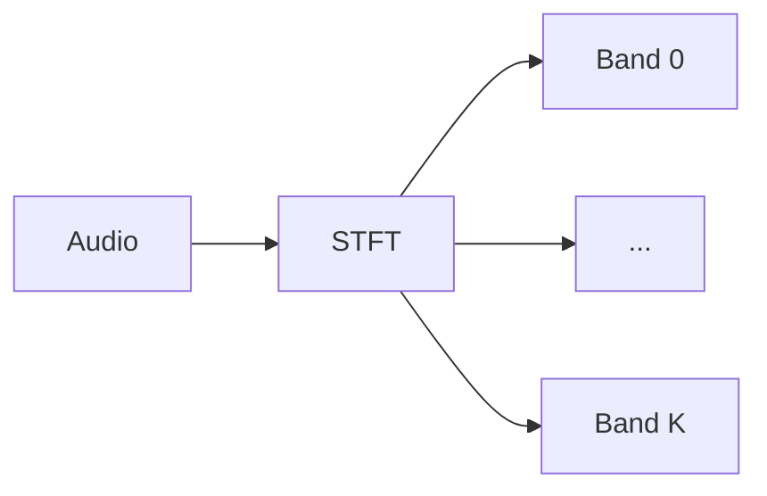

# BSRNN

Band Split Recurrent Neural Network, the discriminative baseline for urgent 2026, kinda lightweight 38M params does real-time on CPU 

## Links

- paper: <https://www.isca-archive.org/interspeech_2023/yu23b_interspeech.pdf>
- code: <https://github.com/espnet/espnet/blob/4bb3c8f8ac6cb111fca8021a91b275aa63f0fa57/espnet2/enh/layers/bsrnn.py#L14>
- docs: <https://espnet.github.io/espnet/guide/espnet2/enh/BSRNN.html>

## Architecture

The idea is that stft bands get splitted, there's some convolution, then dual path LSTMs and then an MLP to predict the mask

## Training

### Paper

Multi resolution spectral distance, MetricGan Discriminator and Multi-res Spectrogram Discriminator.

### Urgent

Just multi resolution spectrum magnitude distance and L1 distance
