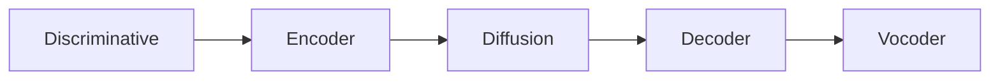

# Hi-ResLDM
## High Resolution Latent Diffusion Model

tags: __se__, __diffusion__, __latent__

## Links
- paper: <https://arxiv.org/pdf/2409.11145>

## Concept
The model is made for 48khz sample rate, targeting highest possible audio quality. The idea it's quite smart, a discriminative, possibly very aggressive, model is frozen in the first stage, this is the input for the encoder. In the latent space there's a diffusion model, the output of which gets decoded to spectrogram and then vocoded to audio.

