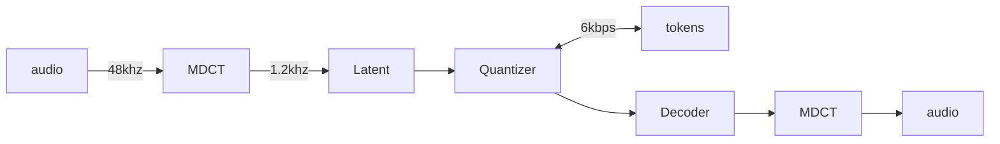
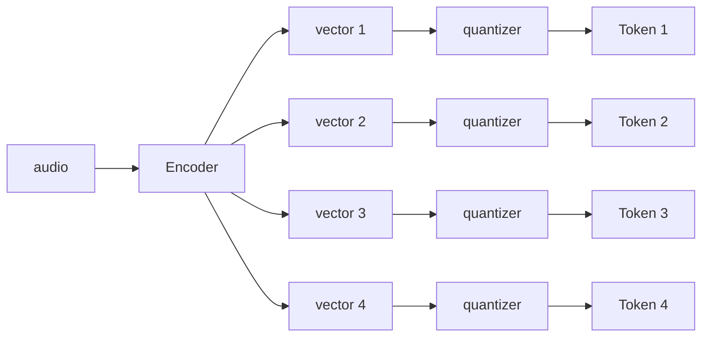

# ParaGSE

PARAllel Generative Speech Enhancement

## Links 

- paper: <https://arxiv.org/pdf/2602.01793>
- code: <https://github.com/fliu215/ParaGSE>
- demo: <https://anonymity225.github.io/ParaGSE/>

## Codec

They use this interesting codec: G-MDCTCodec (Group Modified Cosine Transform Codec) based on GVQ (Group Vector Quantization). This codec outputs multiple independent vectors that then get quantized

#### MDCTCodec

Without the grouping the codec works like this:

examples: <https://pb20000090.github.io/MDCTCodecSLT2024/>

Honestly it doesn't sound that good...

#### G-MDCTCodec

