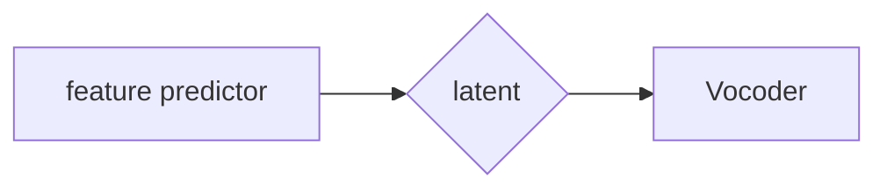

# Sidon

[https://arxiv.org/pdf/2509.17052]()

The idea is having a super smart encoder (a transformer, like HuBERT or similar) for a DAC-like latent space, and adapt the decoder to decode from this new encoder

## Architecture

feature predictor is w2v-BERT, with a linear layer (using lora) added in each block

Vocoder is HiFi-GAN, same concept as descript audio decoder

## Training

- Feature predictor is trained, mapping noisy audio to clean feature (MSE between features)

- Vocoder is trained, from clean feature to clean audio (MSE between Mel spectrograms + Feature Matching Loss)

- Vocoder is fine-tuned, from predicted feature to clean audio (MSE between Mel spectrograms + Feature Matching Loss)
