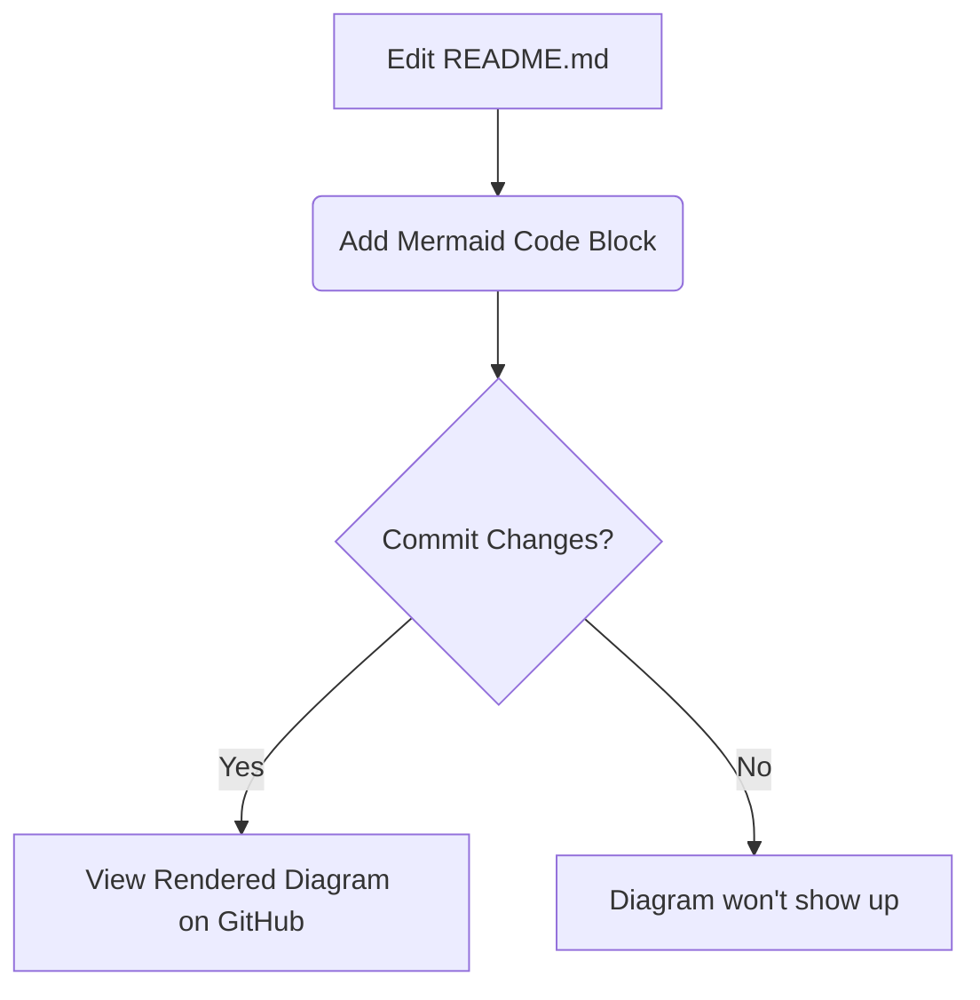

# Markdown

to add multiline code is like this

```python
a = 10
for i in range(a):
    print(i)
```

and let's see mermaid instead


```mermaid
graph TD
    A[Edit README.md] --> B(Add Mermaid Code Block)
    B --> C{Commit Changes?}
    C -->|Yes| D[View Rendered Diagram on GitHub]
    C -->|No| E[Diagram won't show up]
```
