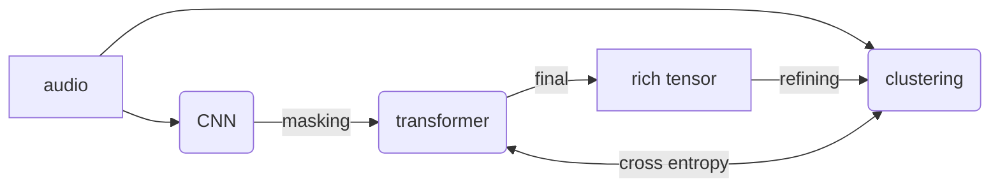

# HuBERT

## Concept

It is predictive not contrastive, which is quite abig difference, it doesn't pick the right one ouf of x like wav2vec but it fills in the blank just with entropy loss, the targets are cluster index of the input audio. 

Once it is trained the input is just audio and the final output is a semantically and context rich representation than can be used for various tasks like, transcription, emotion detection, or speaker identification

## Architecture

The architecture is the standard wav2vec architecture:

### CNN

The CNN is 7, blocks, 1d, the first applies a downsampling of 10x, the following of 2x, for a total downsampling of 320x, getting from 16khz to 50hz rate. All the layers have 512 channels.

### BERT

BERT stands for Bidirectional Encoder Representations from Transformers. the idea is that it is made to build a meaningful and contextful representation

### Projection

## Training

### Hidden audio units

So we have an utterance (vocal sound), goes through the CNN and it is now encoded, $X=[x_0, x_1, ... x_T]$ of $T$ frames. We take a clustering model (eg kmeans) and we have now hidden units (ie labels, cluster index, discrete stuff): $h(X) = Z = [z_0, z_1, ..., z_T]$ we call this hidden because it is like internal of the machine, we don't impose the clusters and we don't really care what they are.

### Masking

On this audio units we apply a mask at the indices $M \subset [T]$ and we obtain $\tilde{X}$ a version of $X$ in which some frames are replaced with the masking embedding $\tilde{x}$. This is applied in a span masking fashion with a masking factor of around 50%, that means that long contiuous portions will be masked.

### Loss

Cross-Entropy loss (right class = good) is used to train the model, and it is only calculated on the masked units, in this way the model can actually learn to understand the context and doesn't just mimick the clustering model

### Refining the clustering

Several tricks are used to get a better clustering:

- __cluster ensambles__: multiple k means models are used in parallel, with different Ks thus different granularity

- __latent clustering__: new generations of clusters are done directly on the learn latents, not on the audio MFCCs, and with the proceeding of the learning this clusters become more and more meaningful

### Fine tuning

Like for wav2vec a final supervised fine tuning is applied with CTC loss with the CNN frozen

## Result

## Take-aways
